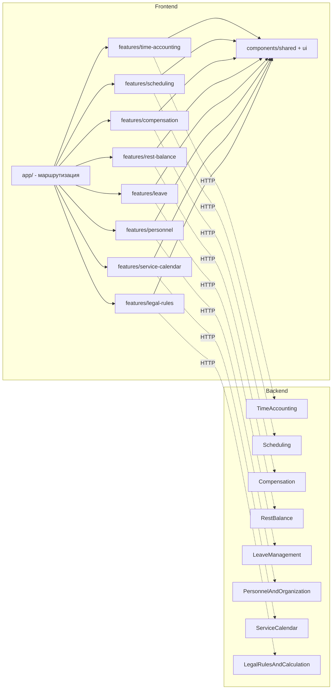

# Frontend Architecture
## Next.js App Router + TypeScript + React + shadcn/ui + Tailwind

**Кода нет.** Ниже — страницы, layouts, компоненты, feature modules и стратегия управления состоянием, спроектированные как прямое зеркало backend-архитектуры (Modular Monolith, Clean Architecture, Vertical Slice, CQRS) и контракта `openapi.yaml`.

---

## 0. Сквозной принцип: Frontend повторяет границы Backend

Frontend не изобретает свою собственную декомпозицию — он использует **те же восемь модулей**, что и backend (Architecture, разд. 4): `legal-rules`, `personnel`, `service-calendar`, `scheduling`, `time-accounting`, `compensation`, `rest-balance`, `leave`. Это не совпадение, а сознательное решение: один и тот же bounded context не должен по-разному называться и по-разному резаться на клиенте и на сервере — иначе теряется единый язык (Ubiquitous Language) на стыке.

```
Backend module (Architecture)  ⇄  Frontend Feature Module
Backend Contracts/ (DTO)        ⇄  Frontend zod-схемы + TS-типы (в идеале — генерируются из openapi.yaml)
Backend Command/Query           ⇄  Frontend Mutation/Query (TanStack Query)
Backend CQRS-модуль             ⇄  Frontend модуль с раздельными query- и command-хуками
```

---

## 1. Верхнеуровневая структура репозитория

```
src/
├─ app/                              ← App Router: ТОЛЬКО маршрутизация и композиция
│  ├─ layout.tsx                     корневой layout (providers)
│  ├─ (auth)/
│  │   └─ login/page.tsx
│  └─ (app)/                         защищённая зона (требует сессии)
│      ├─ layout.tsx                 shell: топ-бар + ролевой сайдбар
│      ├─ page.tsx                   ролевой дашборд ("/")
│      ├─ time-accounting/...
│      ├─ scheduling/...
│      ├─ compensation/...
│      ├─ rest-balance/...
│      ├─ leave/...
│      ├─ personnel/...
│      ├─ service-calendar/...
│      └─ legal-rules/...
│
├─ features/                         ← "Application-слой" фронтенда, один в один с backend-модулями
│  ├─ time-accounting/
│  │   ├─ api/
│  │   │   ├─ queries.ts             (типы функций — не код: обёртки над GET-эндпоинтами)
│  │   │   └─ commands.ts            (обёртки над POST/PATCH-эндпоинтами, с Idempotency-Key)
│  │   ├─ hooks/                     useTimesheetSummaryQuery, useRegisterEventMutation, ...
│  │   ├─ schemas/                   zod-схемы, зеркало DTO из openapi.yaml
│  │   ├─ types/                     сгенерированные TS-типы из openapi.yaml
│  │   └─ components/                фиче-специфичные компоненты (см. разд. 4)
│  ├─ scheduling/            (та же внутренняя структура)
│  ├─ compensation/
│  ├─ rest-balance/
│  ├─ leave/
│  ├─ personnel/
│  ├─ service-calendar/
│  └─ legal-rules/
│
├─ components/
│  ├─ ui/                            shadcn/ui примитивы (Button, Dialog, Table, Form, ...)
│  └─ shared/                        композитные, НЕ привязанные к одному модулю компоненты
│      (DataTable, DateRangePicker, StatusBadge, RoleGate, ProvenanceTooltip, PageHeader, EmptyState)
│
├─ lib/
│  ├─ api-client/                    типизированный HTTP-клиент (base fetch + auth + Idempotency-Key)
│  ├─ auth/                          доступ к сессии (роли, unit_scope) — сервер и клиент
│  └─ query-client.ts                конфигурация TanStack Query (staleTime, retry, ключи)
│
└─ store/                            минимальный клиентский стор (см. разд. 6) — НЕ для серверных данных
```

**Правило границ (зеркало backend, Architecture разд. 6):** страница в `app/` не обращается к API напрямую — только через хуки своего `features/<module>`. `features/<module>` одного модуля не импортирует `features/<другой-module>` напрямую — если экрану нужны данные из двух модулей (например, дашборд компенсаций внутри карточки сотрудника), это компонуется на уровне `app/`-страницы, а не через кросс-импорт фич.

---

## 2. Страницы (маршруты) — по модулям, с привязкой к ролям и use case (SRS)

| Маршрут | Роль(и) | Use Case (SRS) | Тип рендеринга |
|---|---|---|---|
| `/login` | все | — | Client (форма) |
| `/` | все (контент зависит от роли) | — | Server, ролевой виджет-набор |
| `/time-accounting/my` | employee | UC-13 (свой баланс) | Server |
| `/time-accounting/timesheets/[timesheetId]` | timekeeper, unit_commander | UC-04, UC-07 | Server + Client-острова (форма события) |
| `/time-accounting/timesheets/[timesheetId]/events/new` | shift_commander, timekeeper | UC-04, UC-06 | Client (модалка, intercepting route) |
| `/time-accounting/units/[unitId]/dashboard` | unit_commander, regional_commander | UC-15 | Server (агрегация read-модели) |
| `/scheduling/units/[unitId]` | timekeeper | UC-02 | Server |
| `/scheduling/schedules/[scheduleId]` | timekeeper, unit_commander | UC-02, UC-03, UC-17 | Client (drag/drop смен) |
| `/compensation/cases/[caseId]` | employee, unit_commander, finance_specialist | UC-08, UC-09 | Server + Client (форма выбора формы компенсации) |
| `/compensation/employees/[employeeId]/history` | employee, finance_specialist | UC-08 | Server |
| `/compensation/regions/[regionUnitId]/forecast` | regional_commander, finance_specialist | UC-15 | Server |
| `/rest-balance/my` | employee | UC-13 | Server |
| `/rest-balance/my/requests/new` | employee | UC-11 | Client (модалка) |
| `/leave/my` | employee | UC-13 | Server |
| `/leave/grants/new` | hr_specialist | UC-12 | Client (форма) |
| `/leave/grants/[grantId]` | employee, hr_specialist | UC-12 | Server |
| `/personnel/employees` | hr_specialist, unit_commander | — | Server (таблица + фильтры в URL) |
| `/personnel/employees/[employeeId]` | hr_specialist, unit_commander, employee (свой) | UC-01 | Server |
| `/personnel/units` | hr_specialist, system_admin | — | Server (дерево, `ltree`) |
| `/service-calendar/[year]` | system_admin | — | Client (табличный редактор дней) |
| `/legal-rules/rules` | legal_officer | — | Server |
| `/legal-rules/rules/[ruleId]/versions/new` | legal_officer | — | Client (конструктор Condition/Formula/Action) |
| `/legal-rules/rule-versions/[versionId]/dry-run` | legal_officer | — | Client (просмотр diff, см. Rule Engine разд. 9) |
| `/audit/exports` | auditor | UC-14 | Server (только чтение) |

**Именование URL совпадает по существу с `paths` в `openapi.yaml`** (например, `/time-accounting/units/{unitId}/dashboard` ↔ `GET /time-accounting/units/{unitId}/timesheet-dashboard`) — это не строгое требование, но сознательный выбор для снижения когнитивной нагрузки при переключении между фронтенд- и бэкенд-контекстом.

---

## 3. Layouts (вложенные, по конвенции App Router)

```
app/layout.tsx                                    Providers: ThemeProvider, QueryClientProvider,
  │                                                 SessionProvider, Toaster (shadcn Sonner)
  │
  ├─ (auth)/layout.tsx                              Минимальный: центрированная карточка, без нав.
  │
  └─ (app)/layout.tsx                               Проверка сессии (redirect → /login если нет).
      │                                             Топ-бар (профиль, роль, поиск) + Sidebar
      │                                             (пункты меню фильтруются по roles сессии —
      │                                             тот же RoleGate, что и внутри страниц).
      │
      ├─ time-accounting/layout.tsx                 Саб-навигация модуля (табы: "Мой табель" /
      │                                              "Табели подразделения" / "Дашборд") —
      │                                              состав табов тоже фильтруется по роли.
      │
      ├─ scheduling/layout.tsx                       Саб-навигация: "Графики" / "Черновики"
      ├─ compensation/layout.tsx
      ├─ rest-balance/layout.tsx
      ├─ leave/layout.tsx
      ├─ personnel/layout.tsx
      ├─ service-calendar/layout.tsx
      └─ legal-rules/layout.tsx
```

### 3.1 Диаграмма вложенности (пример для одного маршрута)

```
GET /time-accounting/timesheets/{id}
        │
        ▼
app/layout.tsx  (providers)
        │
        ▼
app/(app)/layout.tsx  (auth guard, топ-бар, сайдбар — Server Component,
        │              читает сессию на сервере, не мигает при гидратации)
        ▼
app/(app)/time-accounting/layout.tsx  (саб-навигация модуля)
        │
        ▼
app/(app)/time-accounting/timesheets/[timesheetId]/page.tsx
        │  (Server Component: серверный фетч Timesheet + HoursBreakdown
        │   через типизированный API-клиент с переданными cookies)
        ▼
features/time-accounting/components/TimesheetDetail   (композиция ниже)
```

### 3.2 Параллельные и перехватывающие маршруты (Parallel & Intercepting Routes)
- `time-accounting/timesheets/[timesheetId]/@modal/(.)events/new` — модалка «зарегистрировать факт» открывается **поверх** страницы табеля без потери контекста списка, но при прямом заходе по URL/обновлении страницы рендерится как полноценная страница (стандартный паттерн App Router под именно этот сценарий).
- Аналогично для `scheduling/schedules/[scheduleId]/@modal/(.)shifts/new` и `legal-rules/rule-versions/[versionId]/@modal/(.)dry-run`.

---

## 4. Компоненты — три уровня

### 4.1 Уровень 1 — shadcn/ui примитивы (`components/ui`)
Не модифицируются под бизнес-логику. Используются: `Button`, `Input`, `Select`, `Form` (обёртка над React Hook Form), `Dialog`/`Sheet`, `Table`, `Tabs`, `Badge`, `Card`, `Calendar`, `Popover`, `Command` (палитра команд), `DropdownMenu`, `Sonner` (тосты), `Skeleton` (состояния загрузки).

### 4.2 Уровень 2 — общие композитные компоненты (`components/shared`) — не принадлежат ни одному модулю

| Компонент | Назначение |
|---|---|
| `DataTable` | Обёртка `Table` + TanStack Table; понимает конверт пагинации API (`{items, page, pageSize, totalCount}`) единообразно для всех модулей |
| `DateRangePicker` | Единый выбор `periodStart`/`periodEnd`, используется везде, где API принимает период |
| `StatusBadge` | Маппинг enum-статусов (`TimesheetStatus`, `ScheduleStatus`, `CompensationCaseStatus`, `LeaveStatus`) в цвет/текст — единый словарь, не дублируется по фичам |
| `RoleGate` | Условный рендеринг по ролям сессии — тот же набор ролей, что в `security` каждой операции `openapi.yaml` |
| `ProvenanceTooltip` | Показывает `usedRuleVersionId`/`Source` при наведении на любое вычисленное число (норма, компенсация) — прямое отражение требования провенанса из Rule Engine |
| `PageHeader` | Заголовок страницы + breadcrumb + слот действий |
| `EmptyState`, `ErrorPanel` | Единообразные пустые/ошибочные состояния, `ErrorPanel` умеет отрисовать `Problem`-объект (RFC 7807) человекочитаемо |
| `IdempotentActionButton` | Кнопка, оборачивающая мутацию: генерирует `Idempotency-Key` один раз на попытку действия и переиспользует его при ретраях сети |

### 4.3 Уровень 3 — фиче-специфичные компоненты (`features/<module>/components`) — используются только внутри своего модуля

| Модуль | Компоненты |
|---|---|
| `time-accounting` | `TimesheetEventForm` (дискриминированная форма по `eventType`, зеркалит `oneOf`/`discriminator` из DTO), `HoursBreakdownCard`, `ServiceTimeEventTimeline`, `UnitDashboardChart` |
| `scheduling` | `ShiftCalendarGrid` (drag/drop плановых смен), `ScheduleApprovalPanel`, `OverlapWarningBanner` (клиентская подсказка до отправки — «похоже, смены пересекаются», не замена серверной проверки 409) |
| `compensation` | `CompensationLineTable`, `ElectionFormDialog` (выбор `monetary`/`additional_rest_time`, показывается только если `electionAllowed`, приходит от API) |
| `rest-balance` | `RestBalanceGauge`, `MovementLedgerTable` |
| `leave` | `LeaveTimeline`, `RecallDialog` |
| `personnel` | `UnitTreeView` (визуализация `ltree`-иерархии), `ServiceRecordTimeline` |
| `service-calendar` | `CalendarDayGridEditor` |
| `legal-rules` | `ConditionTreeBuilder`, `FormulaTreeBuilder` (визуальные конструкторы деревьев `Condition`/`Formula` из документа Rule Engine — самый сложный UI во всей системе), `RuleVersionDiffViewer` (для dry-run) |

**Правило:** если компонент понадобился в двух модулях — это сигнал поднять его в `components/shared`, а не копировать; но раньше времени поднимать компонент в `shared` «на всякий случай» не следует (симметрично backend-принципу «CQRS только где нужно» — здесь: «shared только когда действительно общий»).

---

## 5. Feature Modules — внутренняя анатомия (Vertical Slice на фронтенде)

Каждый `features/<module>` организован по сценарию использования, а не по техническому типу — то же самое решение, что и в backend `Application/Slices` (Architecture, разд. 6):

```
features/compensation/
├─ api/
│   ├─ queries.ts        getCompensationCase, getCompensationHistory, getRegionalForecast
│   └─ commands.ts       createCompensationCase, recordElection, finalizeCase
├─ hooks/
│   ├─ useCompensationCaseQuery.ts
│   ├─ useCompensationHistoryQuery.ts
│   ├─ useRecordElectionMutation.ts
│   └─ useFinalizeCaseMutation.ts
├─ schemas/
│   └─ compensation.schema.ts     zod, зеркало CompensationCase/CompensationLine DTO
├─ types/
│   └─ compensation.types.ts      сгенерировано из openapi.yaml
└─ components/
    ├─ CompensationLineTable/
    ├─ ElectionFormDialog/
    └─ RegionalForecastChart/
```

Разделение `queries.ts`/`commands.ts` внутри `api/` — прямое отражение backend CQRS-решения (Architecture, разд. 8): там, где backend-модуль разделён на Command/Query (`TimeAccounting`, частично `Compensation`), фронтенд-модуль повторяет это разделение; там, где backend не разделён (`Personnel`, `ServiceCalendar`), фронтенд использует единый `api/client.ts` без искусственного деления.

---

## 6. State Management — по типу состояния, не единым «глобальным стором»

| Тип состояния | Инструмент | Почему именно так |
|---|---|---|
| **Серверные данные** (всё, что приходит из API) | **TanStack Query** | Кэш, инвалидация по тегам, дедупликация запросов, фоновое обновление — не дублируется ни в какой другой стор |
| **Мутации** (команды) | **TanStack Query `useMutation`** + `IdempotentActionButton` | Каждая мутация генерирует `Idempotency-Key`, соответствует конвенции API (см. документ API Conventions, разд. 5) |
| **Форма (структурная валидация)** | **React Hook Form + zod** | zod-схема — клиентское зеркало 400-валидации из `openapi.yaml`; бизнес-инварианты (409/422/423) не дублируются в zod — они приходят из ответа API и заводятся в форму через `form.setError` |
| **Параметры списков/фильтров/периодов** | **URL search params** (`useSearchParams`/аналог) | GET-эндпоинты и так принимают `page`, `pageSize`, `periodStart/End` как query — храня их в URL, а не в компонентном состоянии, получаем шэрибл/букмаркабл-вид без лишнего инструмента |
| **Сессия (роль, `unit_scope`)** | Серверный доступ к сессии (для Server Components) + лёгкий клиентский хук (для Client Components, например для `RoleGate` внутри интерактивных островов) | Роль нужна и на сервере (какие данные вообще запрашивать), и на клиенте (что показывать/включать) |
| **Чисто клиентский UI-стейт** (свёрнут ли сайдбар, активная вкладка конструктора Formula, тема) | Минимальный клиентский стор (Zustand либо React Context) | Сознательно **не** используется для серверных данных — частая ошибка, которую эта архитектура исключает явно |

### 6.1 Диаграмма потока данных

```
Server Component (page.tsx)
   │
   ├─ читает сессию (роль, unit_scope) — сервер
   ├─ вызывает features/<module>/api через типизированный клиент
   │        (передаёт Authorization-заголовок из cookie сессии)
   ▼
Backend REST API (openapi.yaml)
   │
   ▼
HoursBreakdown / CompensationCase / ... (JSON)
   │
   ▼
Server Component рендерит первичный HTML (быстрый первый экран,
минимум клиентского JS — критично при 1 000 000+ читающих пользователей,
см. Architecture, разд. 12)
   │
   ▼
Client Component "остров" (например, ElectionFormDialog)
   │
   ├─ TanStack Query подхватывает начальные данные (hydration из Server
   │  Component через prefetch + dehydrate/HydrationBoundary)
   ├─ пользовательское взаимодействие → useMutation
   │        → Idempotency-Key + Authorization
   ▼
Backend API → 200/409/422/423
   │
   ├─ 200 → invalidateQueries по тегу ресурса → UI обновляется
   └─ 4xx/423 → Problem → form.setError / ErrorPanel, без потери введённых данных
```

---

## 7. Стратегия рендеринга и производительность (согласовано с масштабом 1 000 000+ пользователей)

1. **Server Components — по умолчанию.** Клиентский JS отправляется только тем компонентам, которым нужна интерактивность (`"use client"` — точечно, не на весь модуль). Это прямо снижает нагрузку на устройство пользователя и объём трафика при массовом самообслуживании (сотрудники, смотрящие свой табель/баланс — самый частый сценарий системы, Architecture разд. 12.2).
2. **Кэширование read-путей на грани.** Страницы, отражающие CQRS read-модель backend (`/time-accounting/my`, `/rest-balance/my`) кэшируются через `fetch`-теги Next.js (`revalidateTag`), инвалидируемые событием соответствующей мутации — точное зеркало backend-подхода «write быстрый, read из кэша/проекции» (Architecture, разд. 8, 11).
3. **Клиентские "острова" — точечно.** Тяжёлые интерактивные конструкторы (`ConditionTreeBuilder`, `ShiftCalendarGrid`) изолированы как отдельные Client Components, не утяжеляя соседние Server Component-страницы того же layout.

---

## 8. Диаграмма модульной структуры фронтенда (соответствие backend)



Единственная связь между `features/<module>` — через общие `components/shared` и `lib/`, никогда напрямую друг через друга — то же правило границ, что и на backend (Architecture, разд. 6), перенесённое на фронтенд без исключений.
