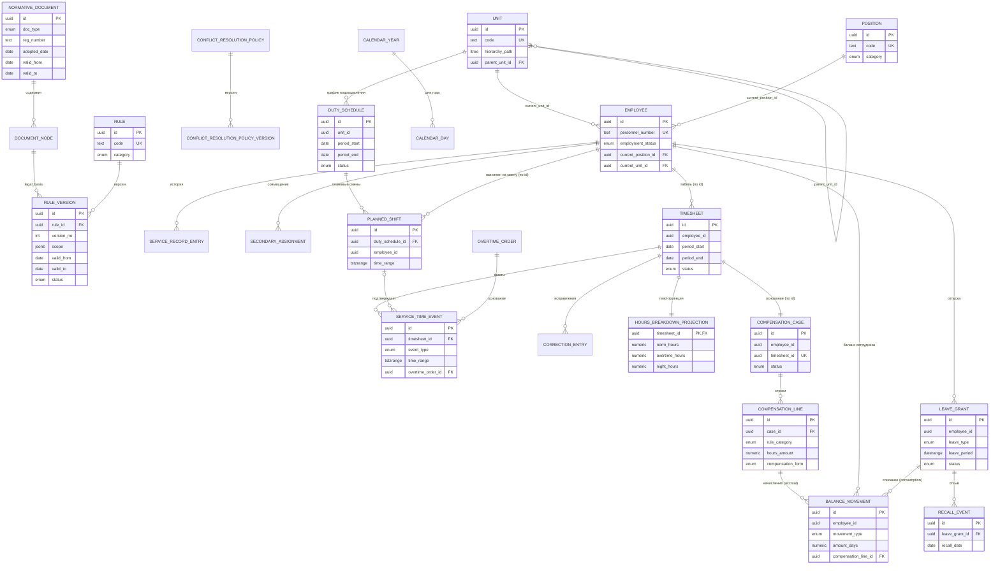

# Логическая модель PostgreSQL
## Система расчёта служебного времени сотрудников ФПС России

**Без ORM.** Ниже — логическая модель на чистом SQL DDL PostgreSQL: схемы, типы, таблицы, ключи, индексы, ограничения, история изменений и версионирование законодательства. Синтаксис проверен по актуальной документации PostgreSQL (Context7, `/websites/postgresql_current`).

Модель напрямую реализует агрегаты и инварианты из документа **Domain Model** и границы модулей из документа **Architecture** — одна схема PostgreSQL на один программный модуль/bounded context.

---

## 0. Расширения, используемые моделью

```sql
CREATE EXTENSION IF NOT EXISTS btree_gist;   -- EXCLUDE-ограничения со скалярными + range-колонками
CREATE EXTENSION IF NOT EXISTS ltree;        -- иерархия подразделений (Unit) без риска циклов
CREATE EXTENSION IF NOT EXISTS pgcrypto;     -- gen_random_uuid() для суррогатных ключей
```

**Соглашение о ключах:** все суррогатные первичные ключи — `uuid DEFAULT gen_random_uuid()`. Естественные бизнес-ключи (табельный номер, код правила, регистрационный номер документа) вынесены в `UNIQUE`-ограничения отдельно от PK — это позволяет менять естественный ключ без каскадного изменения ссылок (что критично для append-only истории).

**Соглашение о схемах:** одна схема PostgreSQL = один bounded context/модуль (см. Architecture, разд. 4). Между схемами — только внешние ключи на суррогатные `id`, никаких кросс-схемных представлений, скрывающих внутреннюю структуру чужой схемы (это database-уровневое отражение правила «Contracts only» из архитектуры).

```sql
CREATE SCHEMA legal_rules;
CREATE SCHEMA personnel;
CREATE SCHEMA service_calendar;
CREATE SCHEMA scheduling;
CREATE SCHEMA time_accounting;
CREATE SCHEMA compensation;
CREATE SCHEMA rest_balance;
CREATE SCHEMA leave_management;
CREATE SCHEMA audit;
```

---

## 1. Схема `legal_rules` — версионирование законодательства (ядро модели)

Это центральная схема, отражающая принцип «Rule → Calculation → Employee». Важно: **ни одна другая схема не хранит числовые значения норм/коэффициентов как собственные атрибуты** — они всегда получаются через `legal_rules.rule_version`, действующую на дату расчёта.

### 1.1 Типы

```sql
CREATE TYPE legal_rules.document_type AS ENUM ('federal_law', 'government_decree', 'departmental_order');

CREATE TYPE legal_rules.document_node_type AS ENUM ('chapter', 'article', 'paragraph');

CREATE TYPE legal_rules.rule_category AS ENUM (
    'norm_calculation',
    'night_hours_classification',
    'holiday_hours_classification',
    'overtime_classification',
    'compensation_coefficient',
    'leave_entitlement',
    'minimum_rest_period'
);

CREATE TYPE legal_rules.rule_status AS ENUM ('draft', 'published', 'superseded');
```

### 1.2 Таблица `normative_document`

```sql
CREATE TABLE legal_rules.normative_document (
    id              uuid PRIMARY KEY DEFAULT gen_random_uuid(),
    doc_type        legal_rules.document_type NOT NULL,
    reg_number      text NOT NULL,
    adopted_date    date NOT NULL,
    title           text NOT NULL,
    valid_from      date NOT NULL,
    valid_to        date,                       -- NULL = действует по настоящее время
    created_at      timestamptz NOT NULL DEFAULT now(),

    CONSTRAINT uq_document_identity UNIQUE (doc_type, reg_number, adopted_date),
    CONSTRAINT ck_document_validity CHECK (valid_to IS NULL OR valid_to > valid_from)
);
```

### 1.3 Таблица `document_node` (главы/статьи/пункты — единая иерархия)

Вместо трёх отдельных таблиц (`chapter`/`article`/`paragraph`) используется одна самоссылающаяся таблица — упрощает модель, не теряя адресуемости конкретного пункта для `legal_basis`.

```sql
CREATE TABLE legal_rules.document_node (
    id                uuid PRIMARY KEY DEFAULT gen_random_uuid(),
    document_id       uuid NOT NULL REFERENCES legal_rules.normative_document(id),
    parent_node_id    uuid REFERENCES legal_rules.document_node(id),
    node_type         legal_rules.document_node_type NOT NULL,
    ordinal_number     text NOT NULL,             -- "54", "4", "1" — как в тексте акта, не обязательно int
    title             text,
    text_content      text,

    CONSTRAINT uq_document_node_position UNIQUE (document_id, parent_node_id, node_type, ordinal_number)
);

CREATE INDEX ix_document_node_document ON legal_rules.document_node (document_id);
CREATE INDEX ix_document_node_parent   ON legal_rules.document_node (parent_node_id);
```

### 1.4 Таблица `rule` (устойчивая идентичность правила)

```sql
CREATE TABLE legal_rules.rule (
    id            uuid PRIMARY KEY DEFAULT gen_random_uuid(),
    code          text NOT NULL,                 -- устойчивый код, например 'NORM.WEEKLY.HAZARDOUS'
    category      legal_rules.rule_category NOT NULL,
    display_name  text NOT NULL,

    CONSTRAINT uq_rule_code UNIQUE (code)
);
```

### 1.5 Таблица `rule_version` — версионирование правила (ключевая таблица всей модели)

```sql
CREATE TABLE legal_rules.rule_version (
    id                     uuid PRIMARY KEY DEFAULT gen_random_uuid(),
    rule_id                uuid NOT NULL REFERENCES legal_rules.rule(id),
    version_no             integer NOT NULL,
    scope                  jsonb NOT NULL,        -- {"position_category": "...", "service_condition_category": "..."}
    scope_key              text GENERATED ALWAYS AS (scope::text) STORED,  -- для EXCLUDE-сравнения по значению
    legal_basis_node_id    uuid NOT NULL REFERENCES legal_rules.document_node(id),
    formula_definition     jsonb NOT NULL,        -- декларативное описание способа расчёта (не исполняемый код)
    valid_from             date NOT NULL,
    valid_to               date,                  -- NULL = действует по настоящее время
    status                 legal_rules.rule_status NOT NULL DEFAULT 'draft',
    published_at           timestamptz,
    published_by           uuid,                  -- FK на personnel.employee НЕ ставится (кросс-схемная ссылка
                                                   -- только по id, без FK, см. правило в разделе 8)

    CONSTRAINT uq_rule_version_no UNIQUE (rule_id, version_no),
    CONSTRAINT ck_rule_version_validity CHECK (valid_to IS NULL OR valid_to > valid_from),
    CONSTRAINT ck_rule_version_published CHECK (
        (status = 'draft' AND published_at IS NULL) OR
        (status IN ('published','superseded') AND published_at IS NOT NULL)
    ),

    -- Domain Model, инвариант 2.2.1: на любую дату для (rule_id, scope) действует РОВНО ОДНА версия.
    -- valid_to = NULL трактуется как открытый бесконечный интервал через coalesce в диапазоне.
    CONSTRAINT excl_rule_version_no_overlap EXCLUDE USING gist (
        rule_id WITH =,
        scope_key WITH =,
        daterange(valid_from, coalesce(valid_to, 'infinity'::date), '[)') WITH &&
    ) WHERE (status <> 'draft')  -- черновики не участвуют в проверке пересечения периодов действия
);

CREATE INDEX ix_rule_version_rule       ON legal_rules.rule_version (rule_id);
CREATE INDEX ix_rule_version_legalbasis ON legal_rules.rule_version (legal_basis_node_id);
CREATE INDEX ix_rule_version_scope_gin  ON legal_rules.rule_version USING gin (scope);

-- Domain Model, инвариант 2.2.2: RuleVersion неизменяема после публикации.
-- На уровне БД это обеспечивается не декларативным CHECK (нельзя сравнить старое/новое
-- значение в CHECK), а BEFORE UPDATE-триггером, блокирующим изменение content-полей
-- при status IN ('published','superseded') — за исключением перехода published→superseded.
```

### 1.6 Таблица `conflict_resolution_policy` + `conflict_resolution_policy_version`

```sql
CREATE TABLE legal_rules.conflict_resolution_policy (
    id    uuid PRIMARY KEY DEFAULT gen_random_uuid(),
    code  text NOT NULL,

    CONSTRAINT uq_policy_code UNIQUE (code)
);

CREATE TABLE legal_rules.conflict_resolution_policy_version (
    id                 uuid PRIMARY KEY DEFAULT gen_random_uuid(),
    policy_id          uuid NOT NULL REFERENCES legal_rules.conflict_resolution_policy(id),
    version_no         integer NOT NULL,
    precedence_list    jsonb NOT NULL,     -- упорядоченный массив rule_category, например
                                            -- '["holiday_hours_classification","night_hours_classification","overtime_classification"]'
    valid_from         date NOT NULL,
    valid_to           date,
    status             legal_rules.rule_status NOT NULL DEFAULT 'draft',

    CONSTRAINT uq_policy_version_no UNIQUE (policy_id, version_no),
    CONSTRAINT ck_policy_precedence_is_array CHECK (jsonb_typeof(precedence_list) = 'array'),
    CONSTRAINT excl_policy_version_no_overlap EXCLUDE USING gist (
        policy_id WITH =,
        daterange(valid_from, coalesce(valid_to, 'infinity'::date), '[)') WITH &&
    ) WHERE (status <> 'draft')
);
```

---

## 2. Схема `personnel` — сотрудники, должности, подразделения

### 2.1 Типы

```sql
CREATE TYPE personnel.service_condition_category AS ENUM ('normal', 'hazardous_or_dangerous', 'pedagogical');
CREATE TYPE personnel.employment_status         AS ENUM ('active', 'on_leave', 'sick', 'suspended', 'dismissed');
CREATE TYPE personnel.regime_type               AS ENUM ('five_day_week', 'shift_schedule', 'twenty_four_hour_duty', 'unstandardized');
CREATE TYPE personnel.position_category         AS ENUM ('operational', 'administrative', 'pedagogical', 'hazardous_technical');
```

### 2.2 Таблица `unit` (подразделение, иерархия через `ltree`)

```sql
CREATE TABLE personnel.unit (
    id              uuid PRIMARY KEY DEFAULT gen_random_uuid(),
    code            text NOT NULL,
    name            text NOT NULL,
    parent_unit_id  uuid REFERENCES personnel.unit(id),
    hierarchy_path  ltree NOT NULL,   -- например 'main_hq.region_77.detachment_12.station_4'

    CONSTRAINT uq_unit_code UNIQUE (code),
    CONSTRAINT uq_unit_hierarchy_path UNIQUE (hierarchy_path)
);

CREATE INDEX ix_unit_hierarchy_gist ON personnel.unit USING gist (hierarchy_path);
CREATE INDEX ix_unit_parent         ON personnel.unit (parent_unit_id);

-- Domain Model, инвариант Unit-3.3.1 (ацикличность): ltree делает цикл структурно
-- невозможным, так как hierarchy_path каждой записи строится один раз от корня;
-- попытка сделать потомка родителем самого себя обнаруживается приложением при
-- построении path ДО вставки (см. Architecture, NormCalculationService-аналог для Unit).
```

### 2.3 Таблица `position` (должность)

```sql
CREATE TABLE personnel.position (
    id                            uuid PRIMARY KEY DEFAULT gen_random_uuid(),
    code                          text NOT NULL,
    title                         text NOT NULL,
    category                      personnel.position_category NOT NULL,
    default_regime_type           personnel.regime_type NOT NULL,

    CONSTRAINT uq_position_code UNIQUE (code)

    -- Важно: здесь НЕТ столбца "weekly_norm_hours". Норма — не атрибут должности,
    -- а результат обращения к legal_rules.rule_version с category='norm_calculation'
    -- и scope, соответствующим (category, service_condition_category сотрудника) —
    -- см. Architecture, NormCalculationService. Хранение числа здесь нарушило бы
    -- принцип "Rule -> Calculation -> Employee" и сделало бы невозможным
    -- пересчитать норму задним числом при изменении законодательства.
);
```

### 2.4 Таблица `employee` (агрегат-корень)

```sql
CREATE TABLE personnel.employee (
    id                          uuid PRIMARY KEY DEFAULT gen_random_uuid(),
    personnel_number            text NOT NULL,
    full_name                   text NOT NULL,
    rank                        text NOT NULL,
    service_condition_category  personnel.service_condition_category NOT NULL DEFAULT 'normal',
    employment_status           personnel.employment_status NOT NULL DEFAULT 'active',
    current_position_id         uuid NOT NULL REFERENCES personnel.position(id),
    current_unit_id             uuid NOT NULL REFERENCES personnel.unit(id),
    hired_at                    date NOT NULL,
    dismissed_at                date,

    CONSTRAINT uq_employee_personnel_number UNIQUE (personnel_number),
    CONSTRAINT ck_employee_dismissed_consistency CHECK (
        (employment_status = 'dismissed' AND dismissed_at IS NOT NULL) OR
        (employment_status <> 'dismissed' AND dismissed_at IS NULL)
    )
);

CREATE INDEX ix_employee_unit     ON personnel.employee (current_unit_id);
CREATE INDEX ix_employee_position ON personnel.employee (current_position_id);
CREATE INDEX ix_employee_status   ON personnel.employee (employment_status) WHERE employment_status = 'active';
```

### 2.5 Таблица `service_record_entry` (append-only история — Domain Model, `ServiceRecordEntry`)

```sql
CREATE TYPE personnel.service_record_event_type AS ENUM ('assignment', 'transfer', 'rank_change', 'dismissal');

CREATE TABLE personnel.service_record_entry (
    id              uuid PRIMARY KEY DEFAULT gen_random_uuid(),
    employee_id     uuid NOT NULL REFERENCES personnel.employee(id),
    event_type      personnel.service_record_event_type NOT NULL,
    effective_date  date NOT NULL,
    position_id     uuid REFERENCES personnel.position(id),
    unit_id         uuid REFERENCES personnel.unit(id),
    rank            text,
    recorded_at     timestamptz NOT NULL DEFAULT now()

    -- Таблица append-only: UPDATE/DELETE запрещены на уровне привилегий (раздел 7).
);

CREATE INDEX ix_service_record_employee ON personnel.service_record_entry (employee_id, effective_date);
```

### 2.6 Таблица `secondary_assignment` (совмещение, Domain Model 3.1.4)

```sql
CREATE TABLE personnel.secondary_assignment (
    id              uuid PRIMARY KEY DEFAULT gen_random_uuid(),
    employee_id     uuid NOT NULL REFERENCES personnel.employee(id),
    position_id     uuid NOT NULL REFERENCES personnel.position(id),
    valid_period    daterange NOT NULL,

    CONSTRAINT excl_secondary_assignment_overlap EXCLUDE USING gist (
        employee_id WITH =,
        valid_period WITH &&
    )
);
```

---

## 3. Схема `service_calendar`

```sql
CREATE TYPE service_calendar.day_type AS ENUM ('working', 'weekend', 'holiday', 'pre_holiday');

CREATE TABLE service_calendar.calendar_year (
    id          uuid PRIMARY KEY DEFAULT gen_random_uuid(),
    year        integer NOT NULL,
    published   boolean NOT NULL DEFAULT false,

    CONSTRAINT uq_calendar_year UNIQUE (year)
);

CREATE TABLE service_calendar.calendar_day (
    calendar_year_id  uuid NOT NULL REFERENCES service_calendar.calendar_year(id),
    day               date NOT NULL,
    day_type          service_calendar.day_type NOT NULL,

    PRIMARY KEY (day),
    CONSTRAINT ck_calendar_day_year CHECK (extract(year from day)::int = (SELECT year FROM service_calendar.calendar_year WHERE id = calendar_year_id))
);

CREATE INDEX ix_calendar_day_year ON service_calendar.calendar_day (calendar_year_id);

-- Примечание: CHECK со сабселектом в PostgreSQL не поддерживается декларативно
-- (constraint не может ссылаться на другую таблицу) — на практике это ограничение
-- реализуется BEFORE INSERT/UPDATE триггером, сверяющим extract(year from day)
-- со значением calendar_year.year. Здесь оставлено в комментарии, чтобы не потерять
-- инвариант "каждая дата принадлежит ровно одному году" при переносе в реальный DDL.
```

---

## 4. Схема `scheduling`

```sql
CREATE TYPE scheduling.accounting_period_type AS ENUM ('month', 'quarter', 'year');
CREATE TYPE scheduling.schedule_status        AS ENUM ('draft', 'approved', 'closed');
CREATE TYPE scheduling.duty_type              AS ENUM ('five_day_week', 'shift', 'twenty_four_hour_duty');

CREATE TABLE scheduling.duty_schedule (
    id                     uuid PRIMARY KEY DEFAULT gen_random_uuid(),
    unit_id                uuid NOT NULL,              -- ссылка по id на personnel.unit, БЕЗ FK (см. разд. 8)
    period_type            scheduling.accounting_period_type NOT NULL,
    period_start           date NOT NULL,
    period_end             date NOT NULL,
    status                 scheduling.schedule_status NOT NULL DEFAULT 'draft',
    approval_order_ref     text,

    CONSTRAINT uq_duty_schedule_unit_period UNIQUE (unit_id, period_start, period_end),
    CONSTRAINT ck_duty_schedule_period CHECK (period_end > period_start),
    CONSTRAINT ck_duty_schedule_approved_has_order CHECK (
        status <> 'approved' OR approval_order_ref IS NOT NULL
    )
);

CREATE TABLE scheduling.planned_shift (
    id                 uuid PRIMARY KEY DEFAULT gen_random_uuid(),
    duty_schedule_id   uuid NOT NULL REFERENCES scheduling.duty_schedule(id),
    employee_id        uuid NOT NULL,                  -- ссылка по id на personnel.employee, без FK
    time_range         tstzrange NOT NULL,
    duty_type          scheduling.duty_type NOT NULL,

    -- Domain Model, инвариант 5.1.1: у сотрудника не может быть двух пересекающихся смен.
    -- EXCLUDE проверяет пересечение ГЛОБАЛЬНО по employee_id (не только внутри одного
    -- duty_schedule), что автоматически покрывает и пересечение через границу периодов.
    CONSTRAINT excl_planned_shift_no_overlap EXCLUDE USING gist (
        employee_id WITH =,
        time_range WITH &&
    )
);

CREATE INDEX ix_planned_shift_schedule ON scheduling.planned_shift (duty_schedule_id);
CREATE INDEX ix_planned_shift_employee ON scheduling.planned_shift (employee_id);

-- Минимальный межсменный отдых (инвариант 5.1.2) НЕ выражается декларативным
-- ограничением (требует сравнения с "соседней" строкой и обращения к
-- legal_rules.rule_version категории minimum_rest_period) — реализуется
-- доменным сервисом RestPeriodPolicyService на уровне Application, а на
-- уровне БД — опционально BEFORE INSERT триггером с оконным запросом
-- LAG()/LEAD() по (employee_id, time_range) для защиты от гонки при записи.
```

---

## 5. Схема `time_accounting` (ядро, с разделением Write/Read — CQRS)

### 5.1 Типы

```sql
CREATE TYPE time_accounting.timesheet_status AS ENUM ('open', 'pending_approval', 'approved', 'reopened');

CREATE TYPE time_accounting.service_time_event_type AS ENUM (
    'actual_shift', 'sickness', 'suspension', 'overtime_attraction', 'business_trip'
);
```

### 5.2 Таблица `timesheet` (агрегат-корень, Write-side)

```sql
CREATE TABLE time_accounting.timesheet (
    id             uuid PRIMARY KEY DEFAULT gen_random_uuid(),
    employee_id    uuid NOT NULL,                 -- ссылка по id на personnel.employee
    period_type    scheduling.accounting_period_type NOT NULL,
    period_start   date NOT NULL,
    period_end     date NOT NULL,
    status         time_accounting.timesheet_status NOT NULL DEFAULT 'open',

    CONSTRAINT uq_timesheet_employee_period UNIQUE (employee_id, period_start, period_end),
    CONSTRAINT ck_timesheet_period CHECK (period_end > period_start)

    -- Domain Model, инвариант 6.1.4: Timesheet неизменяем после Approved —
    -- реализуется BEFORE UPDATE-триггером, запрещающим изменение status
    -- из 'approved' иначе как в 'reopened' (не напрямую в 'open'/'pending_approval'),
    -- и запрещающим любое изменение полей period_*/employee_id после первой записи.
);
```

### 5.3 Таблица `overtime_order` (документ-основание)

```sql
CREATE TABLE time_accounting.overtime_order (
    id            uuid PRIMARY KEY DEFAULT gen_random_uuid(),
    order_number  text NOT NULL,
    issued_date   date NOT NULL,
    issued_by     uuid NOT NULL,        -- ссылка на personnel.employee, без FK
    reason        text NOT NULL,

    CONSTRAINT uq_overtime_order_number UNIQUE (order_number)
);
```

### 5.4 Таблица `service_time_event` (полиморфные факты внутри табеля)

```sql
CREATE TABLE time_accounting.service_time_event (
    id                  uuid PRIMARY KEY DEFAULT gen_random_uuid(),
    timesheet_id        uuid NOT NULL REFERENCES time_accounting.timesheet(id),
    event_type          time_accounting.service_time_event_type NOT NULL,
    time_range          tstzrange NOT NULL,
    planned_shift_id    uuid REFERENCES scheduling.planned_shift(id),   -- заполнено для actual_shift, если по графику
    overtime_order_id   uuid REFERENCES time_accounting.overtime_order(id),
    business_trip_place text,

    -- Domain Model, инвариант 6.1.1: события одного табеля не пересекаются.
    CONSTRAINT excl_service_time_event_no_overlap EXCLUDE USING gist (
        timesheet_id WITH =,
        time_range WITH &&
    ),

    -- Domain Model, инвариант 6.1.2: привлечение сверх нормы обязано иметь приказ-основание.
    CONSTRAINT ck_overtime_requires_order CHECK (
        (event_type = 'overtime_attraction' AND overtime_order_id IS NOT NULL) OR
        (event_type <> 'overtime_attraction')
    ),
    CONSTRAINT ck_business_trip_has_place CHECK (
        (event_type = 'business_trip' AND business_trip_place IS NOT NULL) OR
        (event_type <> 'business_trip')
    )
);

CREATE INDEX ix_service_time_event_timesheet ON time_accounting.service_time_event (timesheet_id);
CREATE INDEX ix_service_time_event_order     ON time_accounting.service_time_event (overtime_order_id);

-- Domain Model, инвариант 6.1.6 ("сумма ActualShift за сутки на сотрудника ≤ 24ч")
-- требует агрегации SUM() по нескольким строкам — не выражается декларативным
-- CHECK/EXCLUDE, реализуется DEFERRABLE INITIALLY DEFERRED constraint trigger,
-- выполняющим проверку в конце транзакции (после всех вставок в рамках одной
-- операции регистрации смены).
```

### 5.5 Таблица `correction_entry` (append-only исправления, Domain Model `CorrectionEntry`)

```sql
CREATE TABLE time_accounting.correction_entry (
    id                   uuid PRIMARY KEY DEFAULT gen_random_uuid(),
    timesheet_id         uuid NOT NULL REFERENCES time_accounting.timesheet(id),
    original_event_id    uuid NOT NULL REFERENCES time_accounting.service_time_event(id),
    reason               text NOT NULL,
    created_at           timestamptz NOT NULL DEFAULT now(),
    created_by           uuid NOT NULL     -- ссылка на personnel.employee, без FK
);

CREATE INDEX ix_correction_entry_timesheet ON time_accounting.correction_entry (timesheet_id);
```

### 5.6 Read-модель: `hours_breakdown_projection` (CQRS Query-сторона)

Это не «ещё одна таблица фактов», а **денормализованная проекция**, перестраиваемая асинхронно из доменных событий (`ShiftActuallyPerformed`, `TimesheetApproved` и т.д., см. Architecture, разд. 7.2/9.2). Она физически отделена от Write-модели, чтобы путь чтения (1 000 000+ сотрудников) не конкурировал с путём записи за одни и те же строки/блокировки.

```sql
CREATE TABLE time_accounting.hours_breakdown_projection (
    timesheet_id              uuid PRIMARY KEY REFERENCES time_accounting.timesheet(id),
    employee_id                uuid NOT NULL,
    period_start                date NOT NULL,
    period_end                  date NOT NULL,
    norm_hours                  numeric(8,2) NOT NULL,
    actual_hours                numeric(8,2) NOT NULL,
    night_hours                 numeric(8,2) NOT NULL DEFAULT 0,
    holiday_hours                numeric(8,2) NOT NULL DEFAULT 0,
    overtime_hours               numeric(8,2) NOT NULL DEFAULT 0,
    underworked_hours            numeric(8,2) NOT NULL DEFAULT 0,
    computed_from_rule_version_id uuid NOT NULL,   -- ссылка на legal_rules.rule_version, без FK
    computed_at                  timestamptz NOT NULL DEFAULT now()
);

-- Основной паттерн доступа: "сотрудник смотрит свою сводку за период" —
-- индекс покрывает самый частый read-запрос всей системы.
CREATE INDEX ix_hours_breakdown_employee_period
    ON time_accounting.hours_breakdown_projection (employee_id, period_start DESC);
```

---

## 6. Схема `compensation`

```sql
CREATE TYPE compensation.case_status        AS ENUM ('draft', 'finalized');
CREATE TYPE compensation.compensation_form  AS ENUM ('monetary', 'additional_rest_time');

CREATE TABLE compensation.compensation_case (
    id              uuid PRIMARY KEY DEFAULT gen_random_uuid(),
    employee_id     uuid NOT NULL,
    timesheet_id    uuid NOT NULL,        -- ссылка на time_accounting.timesheet, без FK (межмодульная граница)
    period_start    date NOT NULL,
    period_end      date NOT NULL,
    status          compensation.case_status NOT NULL DEFAULT 'draft',

    CONSTRAINT uq_compensation_case_employee_period UNIQUE (employee_id, period_start, period_end),
    CONSTRAINT uq_compensation_case_timesheet UNIQUE (timesheet_id)
);

CREATE TABLE compensation.compensation_line (
    id                        uuid PRIMARY KEY DEFAULT gen_random_uuid(),
    case_id                   uuid NOT NULL REFERENCES compensation.compensation_case(id),
    rule_category             legal_rules.rule_category NOT NULL,
    hours_amount              numeric(8,2) NOT NULL,
    compensation_form         compensation.compensation_form NOT NULL,
    legal_basis_rule_version_id uuid NOT NULL,   -- ссылка на legal_rules.rule_version, без FK
    employee_election_at      timestamptz,

    CONSTRAINT ck_compensation_line_hours_positive CHECK (hours_amount > 0)
);

CREATE INDEX ix_compensation_line_case ON compensation.compensation_line (case_id);

-- Domain Model, инвариант 7.1.2 ("сумма часов компенсации по категории ≤ HoursBreakdown")
-- требует сверки с данными другого модуля (time_accounting) — проверяется в
-- Application-слое (CompensationAllocationService) при создании Case,
-- на уровне БД невозможно и не нужно дублировать эту проверку декларативно.
```

---

## 7. Схема `rest_balance`

```sql
CREATE TYPE rest_balance.movement_type AS ENUM ('accrual', 'consumption');

CREATE TABLE rest_balance.balance_movement (
    id                     uuid PRIMARY KEY DEFAULT gen_random_uuid(),
    employee_id            uuid NOT NULL,
    movement_type          rest_balance.movement_type NOT NULL,
    amount_days            numeric(6,2) NOT NULL,
    movement_date          date NOT NULL,
    compensation_line_id   uuid REFERENCES compensation.compensation_line(id),
    leave_grant_id         uuid,           -- ссылка на leave_management.leave_grant, без FK
    reversed_by_movement_id uuid REFERENCES rest_balance.balance_movement(id),
    created_at             timestamptz NOT NULL DEFAULT now(),

    CONSTRAINT ck_balance_movement_amount_positive CHECK (amount_days > 0),

    -- Domain Model, инвариант 8.1.2: начисление обязано ссылаться на CompensationLine.
    CONSTRAINT ck_balance_accrual_requires_source CHECK (
        (movement_type = 'accrual' AND compensation_line_id IS NOT NULL) OR
        (movement_type = 'consumption')
    )

    -- Таблица append-only (см. раздел 8): исправления — через reversed_by_movement_id,
    -- никогда через UPDATE/DELETE существующей строки.
);

CREATE INDEX ix_balance_movement_employee ON rest_balance.balance_movement (employee_id, movement_date);

-- Текущий остаток — не хранимая колонка, а материализованное представление,
-- пересчитываемое из истории движений (соответствует Domain Model: "баланс —
-- накопительный регистр", не редактируемое напрямую поле).
CREATE MATERIALIZED VIEW rest_balance.current_balance AS
SELECT
    employee_id,
    SUM(CASE WHEN movement_type = 'accrual' THEN amount_days ELSE -amount_days END) AS balance_days
FROM rest_balance.balance_movement
GROUP BY employee_id;

CREATE UNIQUE INDEX ix_current_balance_employee ON rest_balance.current_balance (employee_id);

-- Domain Model, инвариант 8.1.1 ("остаток >= 0 в любой момент") — списание,
-- приводящее остаток в отрицательное значение, отклоняется BEFORE INSERT
-- constraint-триггером на balance_movement, сверяющим текущий остаток
-- (через сам журнал движений, не через материализованное представление,
-- чтобы избежать гонки при конкурентных списаниях в рамках транзакции).
```

---

## 8. Схема `leave_management`

```sql
CREATE TYPE leave_management.leave_type AS ENUM (
    'basic', 'additional', 'personal_circumstances_20y', 'maternity', 'child_care', 'educational'
);
CREATE TYPE leave_management.leave_status AS ENUM ('active', 'recalled', 'completed', 'cancelled');

CREATE TABLE leave_management.leave_grant (
    id                             uuid PRIMARY KEY DEFAULT gen_random_uuid(),
    employee_id                    uuid NOT NULL,
    leave_type                     leave_management.leave_type NOT NULL,
    leave_period                   daterange NOT NULL,
    entitlement_basis_rule_version_id uuid NOT NULL,   -- ссылка на legal_rules.rule_version, без FK
    status                          leave_management.leave_status NOT NULL DEFAULT 'active',

    -- Domain Model, инвариант 9.1.1: периоды отпуска не пересекаются
    -- (границы диапазона '[)' делают "присоединение" смежных отпусков не пересечением).
    CONSTRAINT excl_leave_period_no_overlap EXCLUDE USING gist (
        employee_id WITH =,
        leave_period WITH &&
    ) WHERE (status IN ('active', 'recalled'))
);

-- Domain Model, инвариант 9.1.2: отпуск "по личным обстоятельствам при стаже 20+"
-- выдаётся не более одного раза за всю службу — элегантно выражается частичным
-- уникальным индексом, без доменного сервиса на уровне БД.
CREATE UNIQUE INDEX uq_leave_personal_circumstances_once
    ON leave_management.leave_grant (employee_id)
    WHERE leave_type = 'personal_circumstances_20y' AND status <> 'cancelled';

CREATE TABLE leave_management.recall_event (
    id               uuid PRIMARY KEY DEFAULT gen_random_uuid(),
    leave_grant_id   uuid NOT NULL REFERENCES leave_management.leave_grant(id),
    recall_date      date NOT NULL,
    effective_from   date NOT NULL,

    CONSTRAINT ck_recall_effective_after_recall CHECK (effective_from >= recall_date)
);

CREATE INDEX ix_recall_event_grant ON leave_management.recall_event (leave_grant_id);
```

---

## 9. Схема `audit` — сквозная история изменений

Требование трассируемости (Architecture, разд. 10 п.1; SRS, разд. 9.2) реализуется единым журналом, независимым от бизнес-схем.

```sql
CREATE TYPE audit.operation_type AS ENUM ('insert', 'update', 'delete');

CREATE TABLE audit.audit_log (
    id            bigint GENERATED ALWAYS AS IDENTITY PRIMARY KEY,
    occurred_at   timestamptz NOT NULL DEFAULT now(),
    schema_name   text NOT NULL,
    table_name    text NOT NULL,
    record_id     uuid NOT NULL,
    operation     audit.operation_type NOT NULL,
    changed_by    uuid,             -- ссылка на personnel.employee, без FK (может быть системным процессом)
    old_data      jsonb,
    new_data      jsonb
);

CREATE INDEX ix_audit_log_record ON audit.audit_log (schema_name, table_name, record_id, occurred_at);

-- Таблица иммутабельна: права UPDATE и DELETE отозваны у всех ролей приложения
-- (см. раздел 7). Заполняется универсальным AFTER-триггером, навешиваемым на
-- каждую таблицу, требующую аудита (timesheet, rule_version, compensation_case,
-- balance_movement, leave_grant и т.д.) — механизм триггера один и тот же,
-- различается только имя таблицы-источника.
```

---

## 10. Правило межсхемных ссылок (важное отступление от «наивной» нормализации)

Между схемами (=модулями) **сознательно не ставятся `FOREIGN KEY`** там, где это пересекало бы границу bounded context (например, `scheduling.planned_shift.employee_id` не имеет `REFERENCES personnel.employee`). Это прямое следствие правила Architecture (разд. 6–7): «модуль не зависит от Domain/Infrastructure другого модуля».

| Что это даёт | Чем платим |
|---|---|
| Модули физически (даже в одной БД) не связаны декларативными зависимостями — миграции одной схемы не блокируются структурой другой | Ссылочная целостность между схемами обеспечивается на уровне Application (через Contracts, см. Architecture разд. 9.1), а не СУБД |
| Возможность в будущем вынести схему в отдельную БД/сервис без немедленной ломки FK-графа | Требуется дисциплина в приложении (например, soft-проверка существования `employee_id` перед вставкой) |

Внутри одной схемы (одного модуля) `FOREIGN KEY` используются свободно и полноценно — там разделение агрегатов внутри контекста уже смоделировано в Domain Model, и целостность обязана быть строгой.

---

## 11. Права доступа как реализация append-only истории

```sql
-- Пример роли приложения для схемы personnel: обычная запись разрешена,
-- но история неизменяема.
REVOKE UPDATE, DELETE ON personnel.service_record_entry FROM app_role;
REVOKE UPDATE, DELETE ON rest_balance.balance_movement FROM app_role;
REVOKE UPDATE, DELETE ON audit.audit_log FROM app_role;
GRANT INSERT, SELECT ON personnel.service_record_entry TO app_role;
GRANT INSERT, SELECT ON rest_balance.balance_movement TO app_role;
GRANT INSERT, SELECT ON audit.audit_log TO app_role;
```

Это превращает бизнес-требование «история не переписывается» (Domain Model, разд. 13) из соглашения в проверяемое на уровне СУБД ограничение — попытка `UPDATE`/`DELETE` завершится ошибкой доступа независимо от того, что делает Application-слой.

---

## 12. ER Diagram



*(Диаграмма — логическая, не включает справочные таблицы `document_node`, `calendar_day`, `secondary_assignment`, `conflict_resolution_policy_version`, `audit_log`, `overtime_order` ради читаемости; их связи описаны текстом выше и в DDL.)*

---

## 13. Сводная таблица: где именно живёт версионирование законодательства

| Что версионируется | Таблица | Механизм неизменяемости истории |
|---|---|---|
| Текст нормативного акта | `legal_rules.normative_document` + `document_node` | Новая `valid_to`/новый документ вместо переписывания текста |
| Правило расчёта (норма, коэффициент, классификация часов) | `legal_rules.rule_version` | `EXCLUDE`-ограничение запрещает пересечение периодов действия; статус `published` блокирует редактирование триггером |
| Политика разрешения конфликта категорий | `legal_rules.conflict_resolution_policy_version` | Тот же паттерн `EXCLUDE` по периоду действия |
| Кадровая история сотрудника | `personnel.service_record_entry` | Append-only, `REVOKE UPDATE/DELETE` |
| Исправления табеля | `time_accounting.correction_entry` | Append-only, ссылка на исходную запись, а не перезапись |
| Движения баланса ДДО | `rest_balance.balance_movement` | Append-only + сторно через `reversed_by_movement_id` |
| Любое изменение любой аудируемой таблицы | `audit.audit_log` | Универсальный триггер, иммутабельная таблица |

Это ровно то множество механизмов, которое требовалось п.13 Domain Model: «история никогда не перезаписывается» — здесь реализовано пятью разными, но однотипными техническими приёмами (новая версия / EXCLUDE / append-only / сторно / audit-триггер), выбранными по характеру данных, а не единообразно навязанными.
